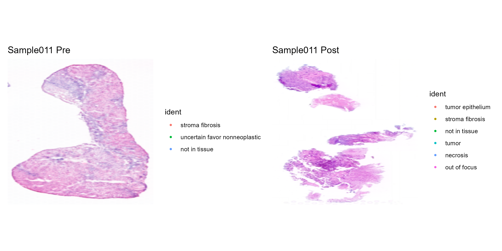
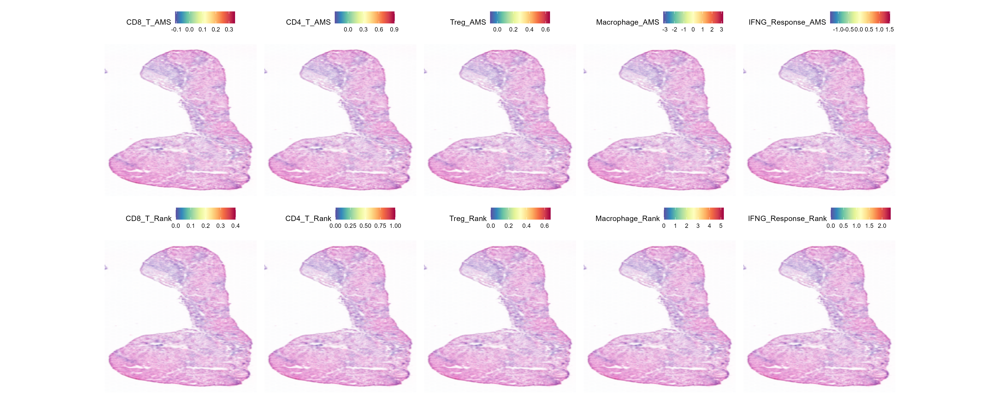
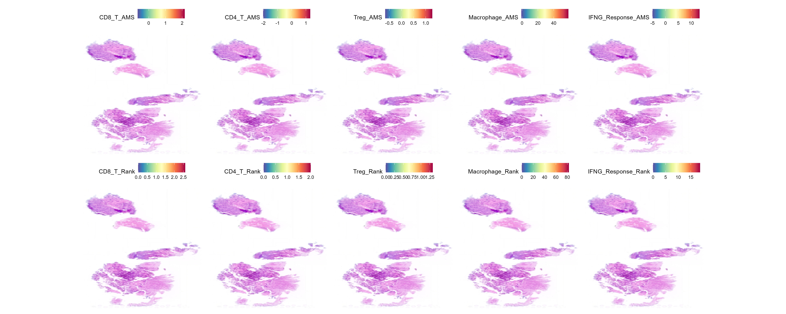

# Spatial Transcriptomics Treatment-Response Analysis

An R-based analysis of paired baseline and on-treatment Visium spatial
transcriptomics samples. The project maps spatial domains, estimates immune
signatures, and compares cell-cell communication before and after treatment.



## Project Questions

1. How does tissue spatial organization change after treatment?
2. Which immune-related signatures are enriched across spatial spots?
3. Which cell-cell communication pathways increase or decrease after treatment?

## Workflow

1. Standardize metadata for 26 Seurat objects and pair baseline/on-treatment
   samples.
2. Run PCA, nearest-neighbor graph construction, and spatial clustering.
3. Estimate CD8 T, CD4 T, Treg, macrophage, and IFNG-response signatures using
   two scoring approaches.
4. Use CellChat to infer communication networks and compare paired samples.
5. Export figures and ranked pathway-change tables for interpretation.

## Key Findings

For the representative Patient 011 paired analysis:

- Post-treatment signaling increased most strongly for **MIF** and
  **COMPLEMENT**.
- **CDH1**, **ITGB2**, **ICAM**, and **TGFb** signaling were detected after
  treatment but not at baseline.
- **ANGPTL**, **WNT**, **PSAP**, and **TENASCIN** signaling decreased after
  treatment.
- Results indicate substantial remodeling of immune and extracellular-matrix
  communication after treatment.

These findings are exploratory and should be validated in additional samples
before biological or clinical interpretation.

## Example Outputs

### Immune-signature scoring comparison

| Baseline | On-treatment |
| --- | --- |
|  |  |

Detailed pathway results are available in [`results/tables`](results/tables).

## Repository Structure

```text
.
|-- R/
|   `-- pipeline_outline.R
|-- results/
|   |-- figures/
|   `-- tables/
|-- .gitignore
`-- README.md
```

## Tools

- R
- Seurat
- CellChat
- ggplot2
- dplyr
- patchwork
- stringr

## Reproducibility Note

The source Seurat objects are not included because of data-access and file-size
constraints. [`R/pipeline_outline.R`](R/pipeline_outline.R) documents the main
analysis design and reusable functions. To reproduce the analysis, provide a
named list of Seurat objects with sample names such as `Sample011Pre` and
`Sample011Post`.

